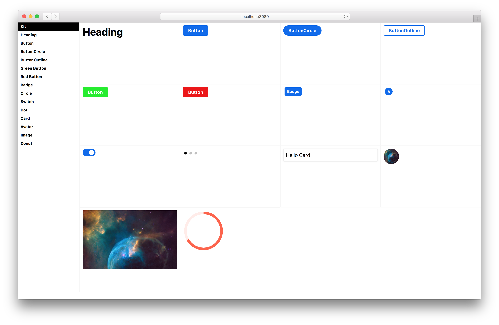
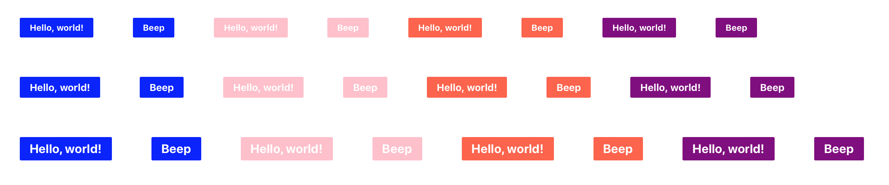

# Compositor Kit

Tools for developing, documenting, and testing React component libraries


- Zero-config development server
- Component library mode
- Utility components for demos and development
- Reuse component examples for development, documentation, and testing
- Read more about Kit on our [blog][blog]

[blog]: https://compositor.io/blog/introducing-kit/

## Getting Started

Install the Kit CLI to get started with isolated component development.

```sh
npm i -g @compositor/kit-cli
```

Create an `examples` folder for your components.
This folder can be used for development, documentation, and testing purposes.

An example file should export a single default component for rendering.

```js
// Button.js example
import React from 'react'
import { Button } from '../src'

export default props =>
  <Button>Button</Button>
```

Start the development server.

```sh
kit examples
```

The index will show a list of links to each example.
Each example will have its own route where it can be viewed in isolation.

### Library Mode

To view all examples in library mode with persistent navigation, use the `--mode` flag.

```sh
kit examples --mode library
```

## Utility Components

If you already have an existing development setup, or want to enhance your examples, use the [Kit components][core] directly in any React setup.

```sh
npm i @compositor/kit
```

### Library

Use the [`Library`][library], `Example`, and `Detail` components to create a custom component library view.



```jsx
import React from 'react'
import { Library, Example } from '@compositor/kit'
import { Button } from '../src'

export default props =>
  <Library>
    <Example name='Button'>
      <Button>Button</Button>
    </Example>
  </Library>
```

### XRay

Use the [`XRay`][xray] component to outline HTML elements and display a grid to help ensure your UI is visually aligned.


```jsx
import React from 'react'
import { XRay } from '@compositor/kit'
import { Button } from '../src'

export default props =>
  <XRay>
    <Button>Button</Button>
  </XRay>
```

### Cartesian

Use the [`Cartesian`][cartesian] component to render the cartesian product of props.



```jsx
import React from 'react'
import { Cartesian } from '@compositor/kit'
import Button from '../src/Button'

export default props => (
  <Cartesian
    component={Button}
    m={4}
    fontSize={[1, 2, 3]}
    bg={['blue', 'pink', 'tomato', 'purple']}
    children={['Hello, world!', 'Beep']}
  />
)
```

### Responsive

Use the [`Responsive`][responsive] component to render components in multiple iframes at different viewport sizes.


```jsx
import React from 'react'
import { Responsive } from '@compositor/kit'
import PageHeader from '../src/PageHeader'

const example = (
  <Responsive>
    <PageHeader />
  </Responsive>
)
```

### Other Components

See the [Kit components][core] package for more components.

## Kit Init

Use the `kit init` command to create a new project based on a growing set of [templates](templates).

## Utilities

- [*kit-snapshot*](snapshot): run Jest snapshot tests for example components

---

## Related

- [@compositor/x0][x0]
- [@mdx-js/mdx][mdx]
- [react-live][react-live]
- [styled-system][styled-system]

## Contributing

1. Fork it
2. Create your feature branch (`git checkout -b my-new-feature`)
3. Commit your changes (`git commit -am 'Add some feature'`)
4. Push to the branch (`git push origin my-new-feature`)
5. Create new Pull Request

---

[Made by Compositor](https://compositor.io/)
|
[MIT License](license)

[x0]: https://github.com/c8r/x0
[mdx]: https://github.com/mdx-js/mdx
[react-live]: https://github.com/FormidableLabs/react-live
[styled-system]: https://github.com/jxnblk/styled-system

[core]: core
[xray]: docs/XRay.md
[cartesian]: docs/Cartesian.md
[library]: docs/Library.md
[responsive]: docs/Responsive.md
